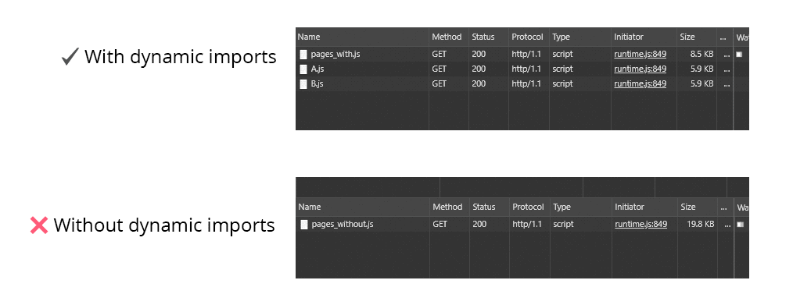
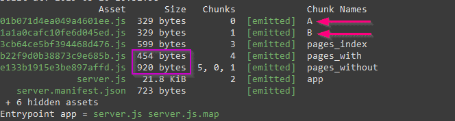

Dynamic Imports in Vue for better performance

I bet you are already familiar with the terms
[**"code splitting"**](https://webpack.js.org/guides/code-splitting/) and **"lazy loading"**.
Let's take the latter definition from
[Webpack's docs](https://webpack.js.org/guides/lazy-loading):

> Lazy, or "on demand", loading is a great way to optimize your site or application.
> This practice essentially involves splitting your code at logical breakpoints,
> and then loading it once the user has done something that requires, or will require,
> a new block of code. This speeds up the initial load of the application
> and lightens its overall weight as some blocks may never even be loaded.

This kind of feature should be done by default by the frameworks we use, as
[some people have suggested](https://twitter.com/slightlylate/status/1018880523446337536).
(Also in the [React ecosystem](https://twitter.com/slightlylate/status/1031934342132461568))

#### The meat:

Whenever it's possible, I'd recommend to use dynamic imports for importing components.
They will be lazily loaded (by Webpack) when needed.

```
- import MyComponent from '~/components/MyComponent.js'
+ const MyComponent = () => import('~/components/MyComponent.js') // code splitting enabled!!
```

#### The explanation:

When using Webpack to bundle your application, you may use different ways to work with modules
(ES Modules, CJS, AMD...). If you choose the ESM way (which is the recommended), you will have this
kind of syntax:

```
import MyComponent from '~/components/MyComponent.js';
```

Notice that there are several use cases where we would like to use asyncronous components.
As explained by Alex Jover in
[this article](https://alexjover.com/blog/lazy-load-in-vue-using-webpack-s-code-splitting/):

- In component importing
- In Vue Router, for components mapping
- In Vuex modules

Let's take a look at the syntax and focus on the `import` part.
If you are using Webpack (or [Parcel](https://parceljs.org)!),
that syntax is going to be transformed on _compilation time_ and these tools are going to use
`Promise`s to load asynchronously your assets/modules/components. Why the need of an arrow function,
you might be wondering: As Alex explained, we need to wrap the `import` with an arrow function to
be resolved (remember, promises...) only when executed.

To demonstrate that they are fully lazy loaded I've prepared a
[repository](https://github.com/gangsthub/dynamic-imports-example)
(using Nuxt.js). It has 2 pages, each of them use different techniques (**With** and **Without**
dynamic imports) to import 2 components (component "A" and component "B"). We will see how, when
loading the page with dynamic imports, webpack loads 2 separate files after the navigation. But,
the page component itself (`/without`) using regular `import`s, is heavier because it loads
everything at once.



<p id="desc1"><i role="img" aria-label="Arrow right emoji">➡</i> Image showing network waterfall when
navigating to both pages. And the differences between both techniches (with and without dynamic
imports)</p>

Yes, by using this technique, Webpack will create separate files ("chunks")
to load them when needed (lazily). Custom chunk naming can be done with
[Magic comments](https://webpack.js.org/api/module-methods/#magic-comments) but
that will be the subject of another article <i role="img" aria-label="Wink emoji">😉</i>.



<p id="desc2"><i role="img" aria-label="Arrow right emoji">➡</i> Image showing the result of nuxt build.
See how different chunks are created for components A and B when dynamic imports are used!</p>

##### That's it!

For a deeper exploration of code splitting techniques check:

- De facto linked article by Anthony Gore: https://vuejsdevelopers.com/2017/07/03/vue-js-code-splitting-webpack/
- Google's web fundamentals article by Addy Osmani and Jeremy Wagner about code splitting:
  https://developers.google.com/web/fundamentals/performance/optimizing-javascript/code-splitting/
- Webpack docs: https://webpack.js.org/guides/code-splitting/

_PS: For this example repo I have used webpack@4.29.6 and Nuxt@2.4.0 which uses Vue@2.5.22._
